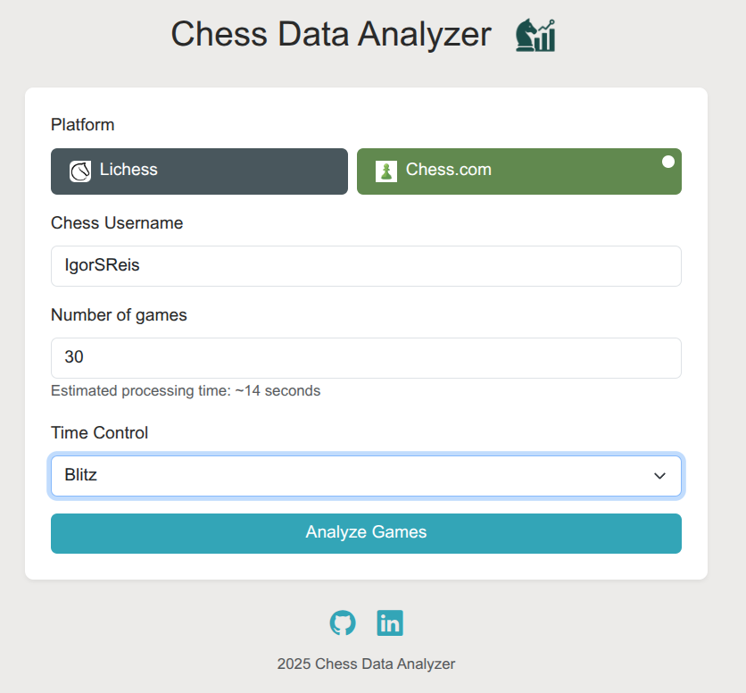

<div style="text-align: center;">
  
</div>

# Chess Analyzer

<div style="text-align: center;">
  
</div>

## Overview
Chess Analyzer is a data-driven web application that helps chess players improve their game by analyzing their match history from platforms like Lichess and Chess.com. Built for my MBA in Data Science & Analytics, this project combines practical engineering with strategic insight, using real-world chess data to generate visual reports and improvement suggestions.

With an intuitive interface and a robust backend built in Flask and Python, the tool retrieves user data via public APIs, normalizes it, and produces actionable insights like:
- Most and least effective openings
- Performance by game type (blitz, bullet, rapid)
- Win/loss/draw distributions
- Strengths and weaknesses by color (white vs black)

This project is inspired by the use of analytics in professional sports and seeks to bring similar capabilities to the world of online chess.

### How It Works
- User Input (Frontend)
- Users enter their lichess.org / chess.com username.
- They can filter by number of games, game type (bullet, blitz, rapid).
- A report is generated based on these inputs and the data collected by the API

### Features
- Supports Lichess and Chess.com usernames
- Visualizes key statistics about openings, win rates, and time control performance
- Normalizes and aggregates large sets of games for scalable analysis
- Cleans and unifies data from two different APIs
- Outputs charts using matplotlib and serves them via Flask
- Extensible architecture for adding custom recommendations or coaching tips
- Built with Sphinx-compatible docstrings, proper logging, and PyLint-compliant style

## Technologies Used
- Flask – Web framework
- pandas – Data wrangling
- matplotlib – Chart generation
- requests – HTTP requests to chess platforms
- Sphinx – Documentation generator
- PyLint – Code linting
- Python logging – Lazy-formatting, consistent logs

### Project Structure
```
chess-analyzer/
├── app.log
├── docs
├── LICENSE
├── README.md
├── requirements.txt
├── src
│   ├── api
│   ├── services
│   └── web
│       ├── static
│       └── templates
└── stockfish
```

### Deployment
This app is designed to run on cloud platforms such as Render or PythonAnywhere, although you can run it locally. You'll just need to set up the server with Flask and configure the environment accordingly.

## Author
**[Igor Reis](https://www.linkedin.com/in/igor-reis-167832149/)**
MBA in Data Science & Analytics
Project developed as part of the final capstone (TCC)

### License

This project is licensed under the [MIT License](LICENSE).

Attribution is appreciated. Created by [Igor Reis](https://www.linkedin.com/in/igor-reis-167832149/).
